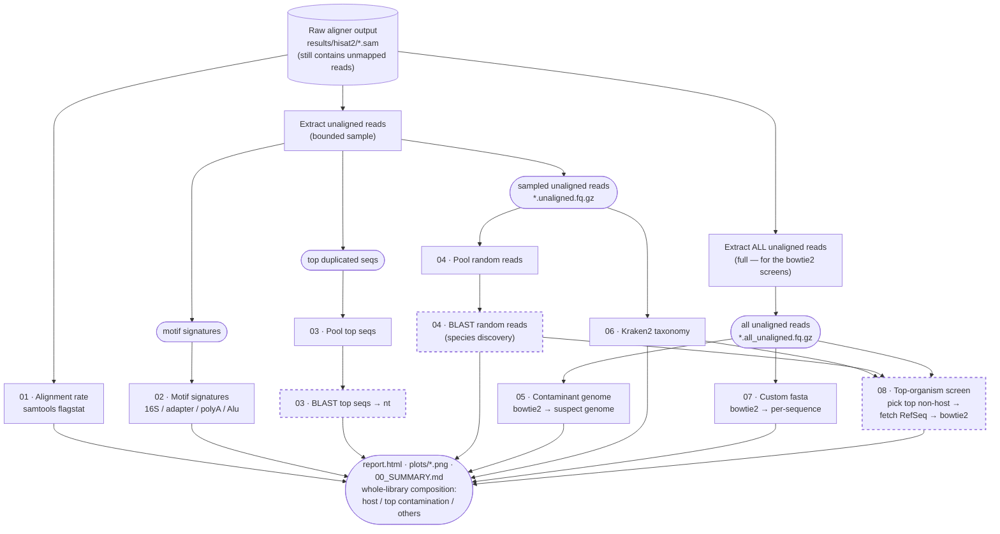

# Workflow

Low-alignment / contamination diagnostics: take the reads that failed to align to the
host genome and figure out **what they are**. Each numbered step answers the question a
different way.

Two read pools, from two **unnumbered extraction steps**: one pulls a **bounded sample** of the
unaligned reads (`sampling.*` caps) for the motif (02), top-seq/BLAST (03/04) and Kraken2 (06)
steps; the other pulls **all** unaligned reads for the **bowtie2 genome screens** (05, 07, 08).
The extraction steps feed downstream screens but are not themselves sections in the final report.

**Dashed nodes** (`03 BLAST`, `04 BLAST random`, `08 top-organism`) need **internet** → run them on a
**login node**. Everything else runs offline on a compute node (`sbatch run.slurm`).

The two **extraction steps** are unnumbered: they feed the screens but don't appear as sections in
`report.html` (one = bounded sample, one = all unaligned reads).

## Steps

| step | question | tool | key output | needs |
|---|---|---|---|---|
| **01** | which samples align poorly? | `samtools flagstat` | `01_alignment_summary/` | — |
| **02** | are they foreign or host? | motif screen | `02_sequence_signatures/` | — |
| **03** | identity of the *top* unaligned seqs | `blastn -remote` | `03_blast_top_sequences/` | login · `blast.enabled` |
| **04** | species the DB/motifs miss (random reads) | `blastn -remote` | `04_blast_random/` | login · `blast.random` |
| **05** | quantify vs a suspect genome | bowtie2 | `05_contaminant_genome_screen/` | `contaminant.reference_fasta` |
| **06** | full taxonomic breakdown | Kraken2 | `06_kraken2/` | `kraken.db` |
| **07** | map to a custom construct (per sequence) | bowtie2 + idxstats | `07_custom_sequences/` | `custom.fasta` |
| **08** | auto-pick top non-host organism → align to its RefSeq genome | pick + NCBI fetch + bowtie2 | `08_top_organism/` | login · `auto_ref.enabled` |
| — | extract unaligned reads — feeds the screens (two pools: bounded sample + all) | `samtools` | `unaligned_reads/` | — |
| — | figures + interactive report + synthesis | matplotlib / html | `plots/`, `report.html`, `00_SUMMARY.md` | — |

The **whole-library composition** in `report.html` splits every read into **host (aligned)** /
**top contamination** (the precise bowtie2 genome alignment from step 08, else step 05) / **others**.

See [`METHOD.md`](METHOD.md) for the reasoning behind each step.
